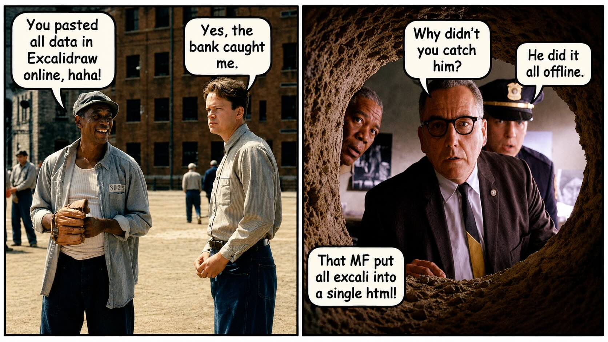

# StaticBoard

Excalidraw is one of the best tools for creating diagrams and hand-drawn visuals. But, you can't use it online and paste sensitive data. Even running it offline requires complex installation and not all machine have that kind of priviledge. To solve this I was looking for a solution where there would be minimal setup and just one html file and everything can be run offline. No install no setup. Like:

> Just download one file, open it, and start drawing.

That is the idea behind StaticBoard. While desinging it I removed all the complexitiies like user accounts, team collaboration, cloud storage, session management, or other enterprise features. Amd  by removing those featurs I was able to embeed all excali into a single htmkl file which can be just downloaded and run and it gives you almost all excali features.

## How to run it

1. Download `index.html`.
2. Open it in your browser.

That is all.

There is no installer, server, login, database, or configuration.

## What it can and cannot do

StaticBoard includes the usual drawing tools such as shapes, arrows, text, freehand drawing, images, undo, redo, zoom, and export.

It also adds a few features that are useful when working with screenshots:

* Paste screenshots directly onto the board
* Add a soft shadow to pasted images
* Draw arrows from inside an image to the surrounding canvas
* Save your work locally in the browser
* Open and save editable Excalidraw files
* Export drawings as PNG or SVG

StaticBoard intentionally leaves out:

* Accounts and sign-in
* Real-time collaboration
* Cloud storage
* Team administration
* Backend services

Those features are useful in larger products, but they would defeat the purpose of keeping StaticBoard simple and portable.

## How is everything inside one file?

StaticBoard is built with React and uses Excalidraw as its drawing engine.

Normally, a web application contains separate JavaScript, CSS, font, and asset files. In this release, the application code and styling are bundled inside `index.html`, allowing the browser to run the app directly from that file. The uploaded build contains the application code and its custom image, saving, and export logic within the HTML bundle. 

Images are processed inside the browser, and the current board is saved locally. There is no StaticBoard server receiving your drawings.

## Credits

StaticBoard uses the open-source Excalidraw editor as its drawing engine.

The aim of this project is not to hide that connection. It is to make the drawing experience easier to distribute and use in places where installing or hosting a full application is inconvenient.

## Project status

StaticBoard is still being improved. Future versions may add more useful features, but the basic idea will remain the same:

> One file. Open it and start drawing.

---